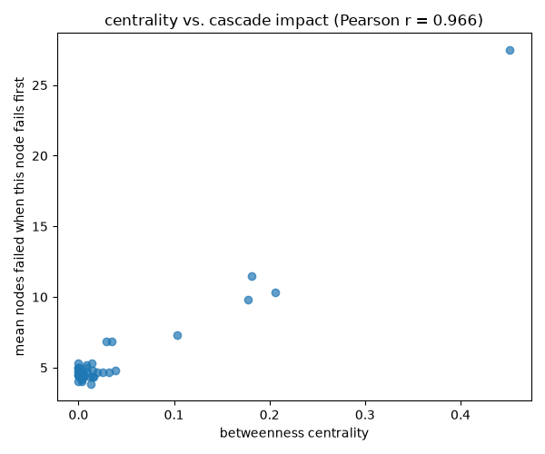
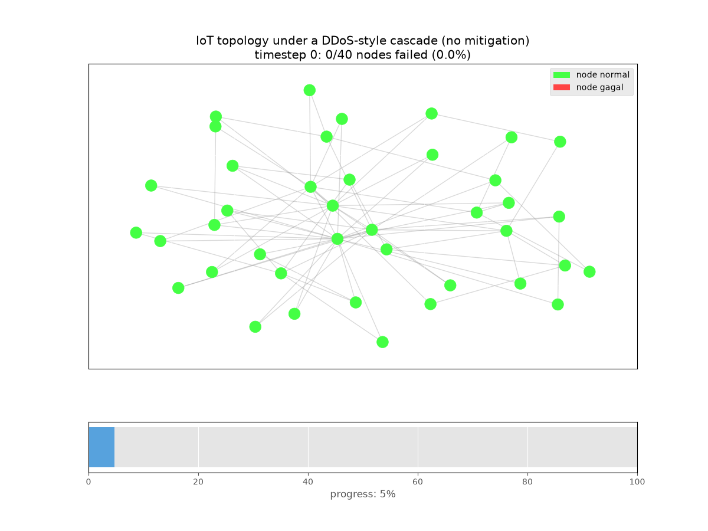

# IoTLock

[](https://github.com/poggymacello/iotlock/actions/workflows/ci.yml)

**Data: synthetic (see Limitations).** For a version of this portfolio built on a real, labeled dataset with a deployed inference service, see [shadowtrace](https://github.com/poggymacello/shadowtrace).

IoT network resilience analysis: scale-free topology, node criticality, and defensive mitigation, purely as simulation.

## Problem

IoT deployments aren't uniformly connected: a handful of hub-like nodes (gateways, aggregation points) end up carrying most of the traffic, while most devices have only a couple of connections. The interesting question for resilience isn't just "does a DDoS-style flood cause failures," it's "which nodes matter most when they go down, and which defensive response actually slows the damage." This is a defensive simulation and visualization tool for exploring those questions, not an attack tool — every result here comes from a synthetic, procedurally generated topology.

## Approach

A scale-free network is built and subjected to a simulated, escalating traffic flood. Node failures can cascade to neighbors. Three defensive strategies are compared using Monte Carlo simulation (30 trials each): no mitigation, rate limiting, and automatic isolation of failed nodes. Separately, betweenness centrality is checked against actual measured cascade impact, rather than just assumed to matter.

## Data

There's no external dataset; the topology and traffic are both generated (`src/iotlock/topology.py`, `src/iotlock/simulation.py`), see [`data/README.md`](data/README.md). The network is a Barabási-Albert graph (40 nodes, `m=2`), which reproduces the hub-and-spoke degree distribution real IoT/internet-like networks tend to have via preferential attachment — a meaningfully different structural assumption than the uniformly random graph the original version of this project used, where every node has roughly the same number of connections and there's no real hub to reason about.

## Method

Traffic intensity escalates over time (Poisson-distributed, rate capped at a moderate ceiling so the simulation doesn't trivially converge to total collapse regardless of mitigation — see the docstring in `simulation.py`). A node fails if its traffic exceeds capacity, or if at least half its original neighbors have already failed (cascading effect). Three strategies:

- **none**: no mitigation, the raw cascade.
- **rate_limit**: incoming traffic is throttled to 70% before the overload check — reduces the chance of direct overload without eliminating it, and does nothing about cascading.
- **isolate_failed**: failed nodes are treated as removed from the graph for computing cascade pressure (an automatic quarantine/reroute), which eliminates the cascade mechanism entirely and leaves only direct overload as a failure cause.

Node criticality is measured with betweenness centrality, then checked against actual impact: for each node, force it to fail first and measure how many nodes end up failed shortly afterward (10 timesteps, before the network has a chance to fully saturate regardless of the starting point — see Results).

## Results

Monte Carlo survival, 40 nodes, 30 trials per strategy, 20 timesteps (seed 42):

| Strategy | Final survival | Time to 50% saturation |
|---|---|---|
| none | 14.3% | timestep 16 |
| rate_limit | 99.6% | never |
| isolate_failed | 61.1% | never |


Rate limiting comes out on top here, which is worth explaining rather than just reporting: in this model, a cascade needs a seed (at least one node has to fail directly from overload before it can spread to neighbors). A 30% traffic reduction is enough to make that seeding event rare, so the cascade mechanism barely ever gets triggered in the first place. Isolating failed nodes stops a cascade from spreading once it starts, but doesn't prevent individual nodes from still failing directly from overload one at a time, so its improvement over "none" (61% vs 14% survival) is real but more limited than cutting the trigger off at the source. Neither result should be read as "rate limiting is strictly better than isolation in general" — it's specific to a model where overload is the only cascade trigger.

Betweenness centrality vs. measured cascade impact (forcing each node to fail first, no mitigation, 6 trials/node):



Pearson r = 0.966 at a 10-timestep horizon. That number is sensitive to the horizon: measured at the full 20-timestep horizon used for the survival curves above, the correlation collapses to roughly 0.07, because by then the "none" cascade has usually consumed most of the network regardless of which node started it (a ceiling effect — everyone's near 100% failed either way, so which specific node seeded it stops mattering). Centrality predicts *how fast* a cascade spreads, which is only visible before the network saturates.



The animation shows one representative no-mitigation run: the scale-free topology's hub structure is visible in the layout, and failures visibly propagate outward from a small number of points rather than appearing uniformly at random.

## Limitations

- The traffic/capacity model (fixed capacity, Poisson load, 50%-of-neighbors cascade rule) is a simplification chosen to make the comparison between strategies legible, not a validated model of real network congestion.
- The rate-limit vs. isolation comparison is specific to this model, where overload is the only cascade trigger; a real deployment would likely combine both defenses rather than choosing one.
- No real network topology or traffic trace was used.

## References

- Barabási, A.L. and Albert, R. "Emergence of scaling in random networks." Science, 1999.
- Freeman, L.C. "A set of measures of centrality based on betweenness." Sociometry, 1977.

## Getting started

```bash
git clone https://github.com/poggymacello/iotlock.git
cd iotlock
python3 -m venv .venv
source .venv/bin/activate  # on Windows: .venv\Scripts\activate
pip install -e ".[dev]"
python -m iotlock train     # runs the Monte Carlo comparison, writes assets/metrics.json + figures
python -m iotlock eval      # re-runs the deterministic pipeline and prints metrics
pytest -q                   # run the test suite
ruff check .                # lint
```

## Project structure

```
iotlock/
├── src/iotlock/
│   ├── topology.py        # Barabási-Albert graph + centrality
│   ├── simulation.py       # cascade simulation with mitigation strategies
│   ├── evaluate.py         # Monte Carlo metrics, centrality-impact correlation, plots
│   ├── animate.py           # GIF animation of a representative baseline run
│   └── cli.py                # `iotlock train` / `iotlock eval`
├── tests/                    # pytest suite
├── assets/                   # generated figures + GIF + metrics.json (committed)
├── data/README.md            # notes on why there's no external dataset
├── .github/workflows/ci.yml
├── pyproject.toml
├── requirements.txt
├── Makefile
├── LICENSE
└── README.md
```

## License

MIT, see [LICENSE](LICENSE).
