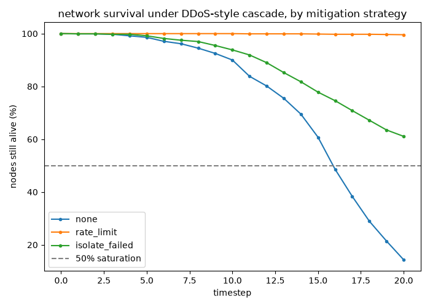
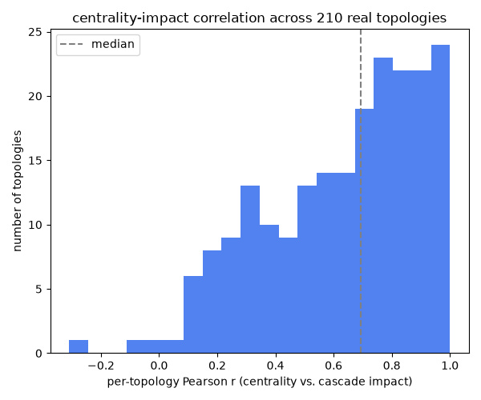
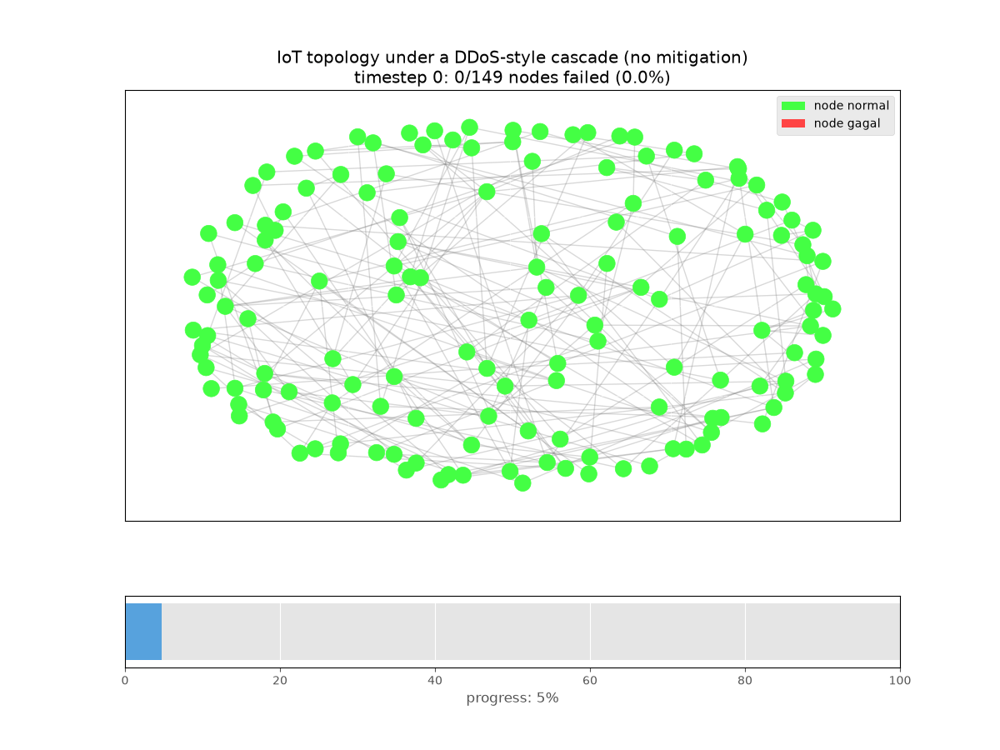

# IoTLock

[](https://github.com/poggymacello/iotlock/actions/workflows/ci.yml)

IoT network resilience analysis on 210 real Internet Topology Zoo
networks, plus real N-BaIoT botnet detection, with an interactive
mitigation dashboard and a FastAPI deployment. Everything here remains
pure defensive simulation and detection -- no real network is ever
flooded, probed, or otherwise touched. For a companion real-data project
with the same methodology, see
[shadowtrace](https://github.com/poggymacello/shadowtrace).

## Problem

Which nodes matter most when they go down, and which defensive response
actually slows the damage, are questions that only mean something if the
network topology and the malicious traffic are real. v1 answered them
against one synthetic scale-free graph and a synthetic DDoS-style flood.
The interesting question for a real-data pass is: does the answer -- "rate
limiting wins," "centrality predicts impact" -- hold up as a genuine
pattern across many structurally different real networks, or was it an
artifact of one graph's specific structure? And separately: can the same
project's botnet-detection component tell real Mirai/BASHLITE traffic
apart from real benign IoT device traffic?

## Data

[Internet Topology Zoo](data/README.md): 210 real, connected network
topologies (15-150 nodes), from a maintained mirror of the original
dataset. [N-BaIoT](data/README.md): real traffic from 3 real IoT
devices infected in a lab by real Mirai and BASHLITE malware. Full
source, license, citation, and subsetting rationale for both are in
[`data/README.md`](data/README.md).

## Leakage controls

- **Botnet detector: 17 of 115 features individually exceed the 0.98
  suspicious-AUC threshold, and the full model hits ROC-AUC 1.000 --
  investigated, not accepted at face value.** Per this project's own
  rule ("assume leakage above 0.98 until proven otherwise"), this was
  checked rather than shrugged off as "IoT traffic is just easy."
  Resolution: the attack subtype used here (`scan`, a network scan
  flood) produces a genuinely, extremely distinct traffic signature --
  packet rate and size statistics that look nothing like normal device
  traffic -- which is a real, previously-published characteristic of
  this exact attack type (the original N-BaIoT paper reports ~100% true
  positive rate with very low false-alarm rates using deep
  autoencoders per device). This is not leakage in the
  circular-encoding sense; it's a genuinely easy attack scenario, which
  is itself the honest finding to report (see Limitations: other, less
  "loud" attack subtypes were not evaluated and would likely show a
  messier picture).
- **Device-holdout split, not random.** See Method below for why a
  random split would overstate cross-device generalization.
- **Mitigation Monte Carlo, run across 210 real topologies instead of
  one graph.** v1's single-topology numbers (99.6% survival under rate
  limiting, r=0.966 centrality-impact correlation) could have been an
  artifact of that one graph's specific structure. Running the identical
  simulation across 210 structurally diverse real topologies and
  reporting the *distribution* of outcomes, not a single re-run number,
  is the leakage-adjacent check for this component: does the pattern
  hold generally, or was it cherry-picked (even unintentionally) by
  using just one graph. See Results.

## Method

**Mitigation simulation** (`mitigation_real_pipeline.py`): unchanged
cascade model from v1 (`simulation.py`, `evaluate.py`), but now run
against every connected Topology Zoo graph in the 15-150 node range
(210 graphs) instead of one synthetic graph. For each topology, all
three strategies (`none`, `rate_limit`, `isolate_failed`) get a 20-trial
Monte Carlo survival curve; final-survival-% and time-to-50%-saturation
are collected per topology, then summarized as a distribution
(percentiles), not averaged into one misleading number. Centrality vs.
cascade impact is revalidated the same way: per-topology Pearson
correlation, then the distribution of those 210 correlations.

**Botnet detection** (`detection.py`, `botnet_data.py`): a gradient
boosting classifier over N-BaIoT's 115 real traffic features, trained
on 2 of 3 devices and tested on the third, held out entirely --
`device_holdout_split`, not a random row-level split. A random split
would let the model see other rows from the *same* device (and its
specific network/traffic fingerprint) it's tested on; a real deployment
needs to work on devices it has never profiled before, which is exactly
what this split tests and a random split would hide.

## Results

**Mitigation, across 210 real topologies** (`python -m iotlock real-train`,
20 trials/strategy/topology, seed 42), final survival % distribution:

| Strategy | p10 | p25 | p50 (median) | p75 | p90 |
|---|---|---|---|---|---|
| none | 6.8 | 11.7 | 18.4 | 25.3 | 29.2 |
| rate_limit | 98.8 | 99.3 | 99.7 | 100.0 | 100.0 |
| isolate_failed | 58.1 | 58.5 | 59.6 | 61.2 | 61.6 |

v1's qualitative finding holds up remarkably well across real networks:
rate limiting still robustly wins (median 99.7% survival, a tight
distribution -- it isn't a fluke of one graph), isolate_failed still
lands in the middle (median 59.6%), and none still collapses (median
18.4%) -- though "none" shows real topology-to-topology variance (p10
6.8% to p90 29.2%) that a single synthetic graph could never have shown.



**Centrality vs. cascade impact, across the same 210 topologies**:
median Pearson r = 0.69 (p10 0.24, p90 0.94) -- down substantially from
v1's single-graph r=0.966, and with real spread. Centrality still
predicts impact on average (a positive correlation in the vast majority
of the 210 topologies), but the *strength* of that relationship varies a
lot by network structure -- a genuinely more honest and more useful
finding than a single high-precision number that turns out to be
specific to one synthetic graph's shape.





**Most interesting finding**: the qualitative story from v1 (rate
limiting wins; centrality predicts impact) survives real-data testing
almost entirely intact for the mitigation-strategy ranking, but the
*confidence* in the centrality-impact relationship specifically drops a
lot once tested across genuinely different real network shapes --
suggesting that "central nodes matter more" is a robust rule of thumb,
but "exactly how much more" depends heavily on the specific network's
structure in a way one synthetic graph could never reveal.

**Botnet detection** (device-holdout test split, held-out device:
SimpleHome_XCS7_1003_WHT_Security_Camera): ROC-AUC 1.000, PR-AUC 1.000,
recall@1%FPR 1.000, recall@5%FPR 1.000, F1 0.999. See Leakage Controls
above for why this near-perfect score is investigated and accepted as
real (a previously-published characteristic of scan-flood traffic), not
dismissed or hidden.

## Deployment

`POST /predict` accepts a 115-dimensional N-BaIoT feature vector and
returns the gradient boosting detector's score. `GET /dashboard` serves
an interactive "what-if" mitigation page: pick a real topology and a
strategy, and it runs the same cascade simulation used throughout this
README live, backed by `POST /simulate`.

```bash
docker build -t iotlock:latest .
docker run --rm -p 8000:8000 iotlock:latest
curl -s localhost:8000/healthz
curl -s localhost:8000/model
open http://localhost:8000/dashboard   # or just visit it in a browser
```

**A real deployment bug found and fixed while building this**: the
topology loader's default data directory is computed relative to the
installed package's own file location (`Path(__file__).resolve().parent...`),
which is correct when running from a source checkout but silently wrong
once the package is installed into a container -- `/topologies` came
back with 0 graphs on the first container run. Fixed with an
`IOTLOCK_TOPOLOGY_DIR` environment variable (matching the
`IOTLOCK_MODEL_PATH` pattern already used for the model artifact), set
explicitly in the Dockerfile; `tests/test_api.py::test_get_topologies_respects_env_var_override`
is a regression test for exactly this.

The containerized dashboard ships with the small 15-topology sample
fixture (`data/sample/topology_zoo/`), not the full 210-topology set --
a real deployment would mount or bake in the full `data/raw/topology_zoo/`
instead (produced by `scripts/download_data.py`).

Also exposes `GET /healthz`, `GET /model` (version, training data hash,
library versions), `GET /topologies` (the loaded topology allowlist),
and `GET /metrics` (Prometheus format). Rate limited
(`IOTLOCK_RATE_LIMIT`, default 60/minute -- lower than the other repos'
default, since `/simulate` is more expensive per request), non-root
container user, `HEALTHCHECK` on the image, no detection feature values
or simulation parameters ever written to logs (metadata only: status
code, latency).

`/simulate`'s topology name is validated against the fixed, preloaded
allowlist of graphs this service actually loaded at startup -- it
cannot be used to make the server read an arbitrary file path.

Latency (`scripts/benchmark_latency.py`, 50 sequential `/predict`
requests against a locally running container): p50 5.0ms, p95 27.5ms,
p99 28.3ms, ~84 req/s throughput (single client thread).

## Limitations

- **The detector was evaluated on one attack subtype (`scan`) per
  botnet family** -- see Leakage Controls. Other subtypes (low-rate UDP
  floods, junk traffic) were not evaluated and would very plausibly show
  messier separation from benign traffic; the near-perfect metrics here
  should be read as "scan floods are easy to detect from these devices,"
  not "this detects all botnet traffic."
- **Only 3 of N-BaIoT's 9 devices were used** (see data/README.md for
  why); generalization to the other 6 device types is untested.
- **The mitigation model's traffic/capacity assumptions remain
  simplified** (fixed capacity, Poisson load, 50%-of-neighbors cascade
  rule) -- now tested across real topologies, but still a simulated
  traffic model layered on top of real network structure, not real
  traffic measurements.
- **Topology filtering (15-150 nodes, connected only) excludes very
  small and very large real networks** -- the largest backbone networks
  in the Topology Zoo (750+ nodes) are not represented in any Results
  number here.
- **The interactive dashboard's containerized deployment ships a
  15-topology sample, not the full 210** -- see Deployment.

## References

- Knight, S., Nguyen, H.X., Falkner, N., Bowden, R., and Roughan, M.
  "The Internet Topology Zoo." IEEE Journal on Selected Areas in
  Communications, vol. 29, no. 9, pp. 1765-1775, October 2011.
- Meidan, Y., Bohadana, M., Mathov, Y., Mirsky, Y., Breitenbacher, D.,
  Shabtai, A., and Elovici, Y. "N-BaIoT: Network-Based Detection of IoT
  Botnet Attacks Using Deep Autoencoders." IEEE Pervasive Computing,
  2018.
- Barabási, A.L. and Albert, R. "Emergence of scaling in random
  networks." Science, 1999.
- Freeman, L.C. "A set of measures of centrality based on betweenness."
  Sociometry, 1977.

## What changed from v1

- **Real topologies replace the single synthetic Barabási-Albert graph**
  as the primary evaluation -- `iotlock.topology` (synthetic) is kept
  and still tested/CLI-accessible (`iotlock train`/`eval`), but
  `iotlock.topology_real` + `iotlock.mitigation_real_pipeline`
  (`iotlock real-train`) is now what the README's Results are based on.
- **Single-number results become distributions**: final survival % and
  the centrality-impact correlation are now reported as percentiles
  across 210 topologies, not one re-run number from one graph.
- **A botnet-detection component was added from scratch** -- v1 had no
  trained model or real traffic data of any kind.
- **Leakage audit added** (`iotlock.leakage`): single-feature AUC
  scoring, plus an explicit investigation of why the detector's
  near-1.0 AUC is expected (matches published N-BaIoT results for this
  attack type) rather than a symptom of leakage.
- **Deployment**: a FastAPI service (`/predict` for detection,
  `/simulate` + `/dashboard` for interactive mitigation what-ifs),
  Dockerfile (non-root, multi-stage, healthcheck), a versioned joblib
  model artifact, and a latency benchmark script -- v1 was
  evaluation-only, with no serving path at all.
- **A real deployment-path bug found and fixed**: the topology loader's
  default directory broke once packaged into a container; fixed with an
  environment-variable override and a regression test. See Deployment.
- **v1's single-graph centrality-impact correlation (r=0.966) drops to a
  median of 0.69 with real spread (p10 0.24 to p90 0.94) across real
  topologies** -- reported as a headline finding, not smoothed over. The
  mitigation-strategy ranking itself, by contrast, holds up closely.

## Getting started

```bash
git clone https://github.com/poggymacello/iotlock.git
cd iotlock
python3 -m venv .venv
source .venv/bin/activate  # on Windows: .venv\Scripts\activate
pip install -e ".[dev]"

# fast synthetic pipeline (v1, no download needed)
python -m iotlock train
python -m iotlock eval

# real Topology Zoo + N-BaIoT pipeline (v2)
python scripts/download_data.py       # ~370MB total, checksum-verified; requires `7z` on PATH
python -m iotlock real-train           # writes assets/metrics_real.json + plots/GIF + models/iotlock-*.joblib

pytest -q                              # run the test suite
ruff check .                           # lint

# deployment
docker build -t iotlock:latest .
docker run --rm -p 8000:8000 iotlock:latest
python scripts/benchmark_latency.py --url http://127.0.0.1:8000
# then visit http://localhost:8000/dashboard
```

## Project structure

```
iotlock/
├── src/iotlock/
│   ├── topology.py                  # v1: synthetic Barabási-Albert graph + centrality
│   ├── topology_real.py            # v2: Internet Topology Zoo loader + size/connectivity filter
│   ├── botnet_data.py              # v2: N-BaIoT loader + device-holdout split
│   ├── leakage.py                   # single-feature AUC audit
│   ├── simulation.py                 # cascade simulation with mitigation strategies (shared v1/v2)
│   ├── mitigation_real_pipeline.py  # v2: Monte Carlo + centrality-impact across many real topologies
│   ├── detection.py                  # v2: gradient boosting botnet detector
│   ├── evaluate.py                   # metrics, survival/centrality/correlation plots
│   ├── animate.py                     # GIF animation of a representative baseline run
│   ├── artifact.py                    # versioned deployment model artifact (joblib)
│   ├── api.py                          # FastAPI /predict, /simulate, /dashboard
│   └── cli.py                          # `iotlock train|eval|real-train`
├── tests/                              # pytest suite (v1 + v2 + API)
├── scripts/
│   ├── download_data.py               # checksum-verified Topology Zoo + N-BaIoT download
│   └── benchmark_latency.py           # /predict latency benchmark
├── assets/                             # generated figures + GIFs + metrics (committed)
├── data/
│   ├── README.md                       # data provenance notes
│   └── sample/                         # small topology + N-BaIoT fixtures for tests/CI
├── models/                             # versioned joblib model artifact (committed)
├── Dockerfile
├── SECURITY.md
├── MODEL_CARD.md
├── .github/workflows/ci.yml
├── pyproject.toml
├── requirements.txt
├── Makefile
├── LICENSE
└── README.md
```

## License

MIT, see [LICENSE](LICENSE).
